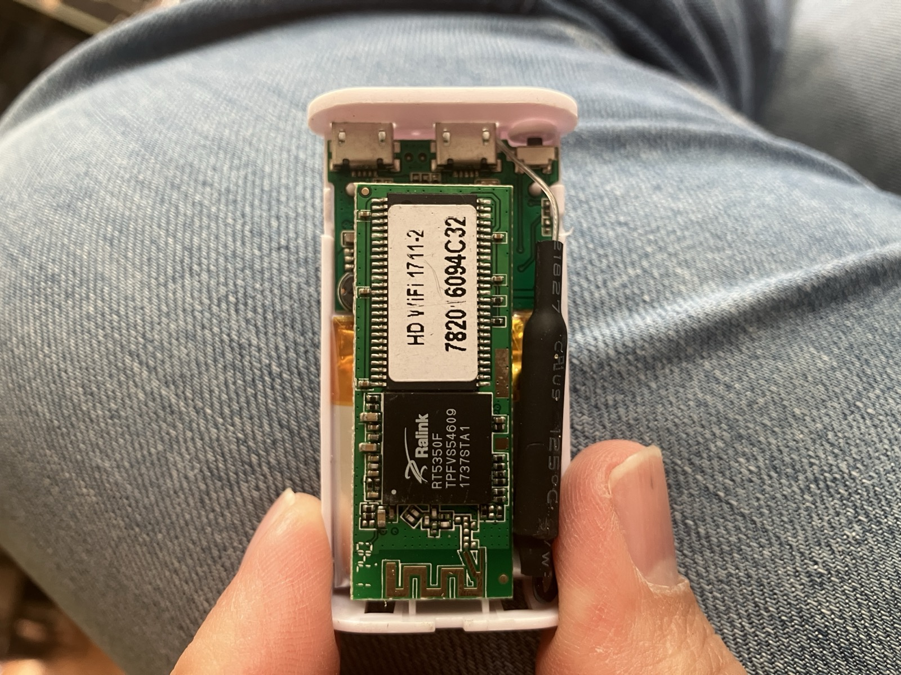

# F99 / "HD WiFi 1711-2" Webcam — Reverse Engineering Notes

RT5350F-based WiFi webcam, MOQO-branded, MAC `78:20:16:09:4C:32`. Operates as
its own access point at `192.168.1.1`. This repo documents how to talk to it
without the original Android app, plus an end-to-end live MJPEG bridge.

## Hardware



- **SoC**: Ralink **RT5350F** (TPFVS54609 / 1737STA1) — 360 MHz MIPS24KEc with
  on-die 802.11n radio. Same chip family as the original Reecam reference
  design.
- **Identification**: silkscreen `HD WiFi 1711-2`, sticker `7820 6094C32`.
  The 8 hex chars on the sticker are the lower bytes of the WiFi MAC
  (`78:20:16:09:4C:32`) and match what `get_properties.cgi` reports as the
  device id.
- Two micro-USB-style jacks at the top edge, a small recessed button on the
  right edge, an antenna trace along the bottom half of the PCB.

## Quick start

```bash
# Connect your Mac to the camera's WiFi AP (SSID HDWIFI_094C32, PSK 12345678).
python3 icap_stream.py
# then open http://127.0.0.1:8081/ in any browser
# (or:  ffplay http://127.0.0.1:8081/stream)
```

Measured **~8.6 fps at 1280×720**. The script:

1. opens TCP/36299 and runs the ICAP login dance (gen-B magic `0x20130809`),
2. sends `start_video`,
3. unwraps the `0x00B0` packets the camera pumps back (17-byte header + raw
   JPEG each) and re-publishes them as `multipart/x-mixed-replace`.

It needs no credentials — the daemon validates them and reports failure, but
serves the stream regardless on this firmware.

## Confirmed device state

From `get_properties.cgi` + `get_params.cgi`:

| Field | Value |
|---|---|
| Device ID | `782016094C32` (= WiFi MAC) |
| Alias | `MOQO-782016094C32` |
| Firmware | `0.1.00000101.3.33` |
| AP SSID | `HDWIFI_094C32` |
| AP WPA2 PSK | `12345678` |
| DHCP uplink IP (when in client mode) | `192.168.0.188` |
| HTTP/CGI port | 36299 (the **only** open TCP port — also speaks the binary ICAP protocol) |
| HTTPS | disabled, and `set_params.cgi?https=1` is rejected |
| Mic / Speaker | yes / yes |
| PTZ | no (motor not present; `/ptz_control.cgi` endpoint exists but always returns `error:-2`) |
| ONVIF / TUTK P2P / Sosocam cloud | no / no / disabled |
| Max simultaneous video clients | 1 |
| Snapshot default resolution | `11` = 1280×720 (also valid: `2` = 160×120, `6` = 640×480; nothing else) |
| `stream1` (main) | res=6 (640×480), codec=0 (H.264), 2048 kbps, 25 fps, gop=25 |
| `stream2..4` (alt profiles) | codec=2, 1024/512/256 kbps, 25–30 fps |
| Admin permission bitmask | `group1=131071` = 0x1FFFF (all 17 bits set) |

## HTTP / CGI reference

Port **36299**, Boa/0.94.14rc21. Auth is query-string only — `?user=admin&pwd=&json=1`.
Default password is empty. Never send an `Authorization:` header; the server
replies `Can't parse request.` and drops the connection.

| Endpoint | Purpose |
|---|---|
| `/get_params.cgi` | Read all configurable params |
| `/set_params.cgi?<k>=<v>&save=1` | Write params (see "accepted fields" below) |
| `/get_properties.cgi` | Static device info |
| `/get_status.cgi` | Runtime state snapshot: `time, alarm, record, network, wifi_signal_level, disk_capability, ddns, ntp, upnp, ...` |
| `/get_log.cgi` | Recent auth-event log (each entry: `event, t, user, ip`) |
| `/snapshot.cgi?resolution=N` | Single JPEG. Valid `N`: 2, 6, 11. *Side effect: persists N as the global `resolution` field.* |
| `/snapshot.cgi?streamid=N` | Single JPEG; `N` ∈ {0..4}. Renders at the current global `resolution` (does NOT use the per-`streamN_resolution` profile, despite the name). ~80 % faster per request than the `resolution=` variant. |
| `/check_user.cgi` | Foscam-style auth check. Returns `var group=131071; var user='admin'; var pwd='';` on success, `var group=-1;` on failure. |
| `/alarm_snapshots.cgi?number=N` | Recent motion-trigger JPEGs |
| `/list_records.cgi`, `/list_subrecords.cgi?t=<id>`, `/search_record.cgi?from=<ts>` | SD card recording metadata |
| `/get_record.cgi?path=<path>` | Download a clip |
| `/get_thumb.cgi?t=<id>&no=<n>` | Recording thumbnail |
| `/ptz_control.cgi?command=N[&param=M]` | PTZ. Endpoint exists; always `error:-2` here because no motor. Real commands from the SDK: 16=set_boot_preset (with `param=N`), 18=get_pt_pos. |
| `/format_sd.cgi`, `/restore_factory.cgi`, `/restore.cgi` | Admin. `/restore.cgi` is distinct from `/restore_factory.cgi` and always returns `error:-6` (presumably "no backup available"). |

Unknown paths return HTTP 200 with body `File not found.` (exactly 15 bytes).
That's the sentinel for path enumeration — anything whose response is NOT 15
bytes is interesting. The full allowlist is the table above; nothing else
exists.

### `set_params.cgi` fields accepted on this firmware

- `reinit_*` family: `video`, `record`, `network`, `ptz`, `camera`, `user`, `http`. (No `stream`, `audio`, `comm`, `ap`, `wifi`, `p2p`, `live`, `sosocam`, `discover`, `udp` — those return `error:-2`.)
- Toggles: `video_on_always`, `record`, `alarm_record`, `led`, `da_defense`.
- Per-field writes: `pwd1` (use `&reinit_user=1&save=1`), `tz` (with `&update_tz=1&save=1`), `https`, `resolution`, brightness/contrast/saturation/sharpness, etc.

Anything not on that list returns `error:-2`. In particular `enable_video`,
`enable_audio` appear in `get_params` output but are read-only computed
properties.

### Operational gotchas

- **Snapshot encoder wedge.** Sustained `/snapshot.cgi` polling above ~4 fps
  for a couple of minutes drives the JPEG encoder into a stuck state where
  every snapshot returns the 16-byte string `Snapshot Failed.`. **Only a
  power-cycle clears it.** `set_params.cgi?reinit_camera=1` also triggers
  this. The snapshot bridge defaults to 2.5 fps for safety; the binary ICAP
  path doesn't have this problem.
- **DA-defence lockout.** `da_defense=1` + `da_retry_times=10` means 10
  failed ICAP `login2_req`s in 5 seconds lock both the ICAP daemon *and* the
  HTTP CGI for ~160 s. While locked, `set_params.cgi?da_defense=0` is
  rejected. Fastest unlock is a power-cycle. If you're going to do anything
  that touches the auth surface heavily, disable DA defence first.
- **`resolution=N` persists.** `/snapshot.cgi?resolution=2` flips the camera's
  stored `resolution` field to 2, which then affects subsequent `streamid=`
  polls. Restore with `set_params.cgi?resolution=11&save=1`.
- **`telnetd=1` is patched out.** The Micro-Drone-era backdoor
  `set_params.cgi?telnetd=1&save=1&reboot=1` is accepted (`error:0`) and the
  camera reboots, but the `telnetd` field reverts to 0 and TCP/23 stays
  closed. None of 27 plausible aliases (`telnet`, `ssh`, `dropbear`, `debug`,
  `console`, `ate`, `factory_debug`, `developer`, `manuf_mode`, ...) are real
  fields either — all silently dropped. No software-only path to a shell on
  this firmware; remaining root routes are UART pads on the board or
  `/upgrade.cgi` firmware injection.

### Probed and confirmed not to exist on this firmware

`videostream.cgi`, `livestream.cgi`, `stream.cgi`, `live.cgi`, `mjpeg.cgi`,
`videostream.asf`, `video.mjpg`, `video.cgi`, `audiostream.cgi`, `audio.cgi`,
`audio.pcm`, `video.h264`, `videostream.h264`, `videostream.flv`,
`raw_video.cgi`, `login.cgi`, `check_login.cgi`, `camera_control.cgi`,
`decoder_control.cgi`, `reboot.cgi`, `get_camera_params.cgi`,
`get_misc.cgi`, `camera_params.cgi`, `get_factory_param.cgi`, `get_alarm.cgi`,
`set_alarm.cgi`, `set_misc.cgi`, `set_datetime.cgi`, `set_network.cgi`,
`set_wifi.cgi`, `set_users.cgi`, `record.cgi`, `get_record_list.cgi`,
`tutk.cgi`, `select_wifi.cgi`, `remove_wifi.cgi`, `set_arm.cgi`,
`enter_scene.cgi`, `leave_scene.cgi`, `set_ewig_melody.cgi`,
`clear_ewig_melody.cgi`, `perform_rf_action.cgi`, `edit_rf_device.cgi`,
`set_license.cgi`, `search_snapshot.cgi`, `del_record.cgi`,
`unregister_from_sosocam.cgi`, `relogin_to_sosocam.cgi`, `index.html`,
`main.html`, `/`. No web UI is served.

Also probed against the [Micro Drone 3.0 Reecam build endpoint list](http://gw.tnode.com/drone/micro-drone-3-0-camera-api/)
and confirmed absent on this MOQO firmware: `videostream.cgi`, `av.asf`,
`backup.cgi`, `wifi_scan.cgi`, `test_wifi_connected.cgi`,
`is_mjpeg_stream_exist.cgi`, `get_badauth.cgi`, `get_session_list.cgi`,
`get_cur_ir_adc_value.cgi`. There is **no HTTP video stream** on this build —
live video is ICAP-only.

## ICAP binary protocol (live video)

The camera speaks a proprietary binary protocol on TCP/36299, sharing the
port with the HTTP CGI. Full wire-level spec is in
[`docs/ICAP_PROTOCOL.md`](docs/ICAP_PROTOCOL.md); summary:

- Two generations exist in the SDK family. **This device is generation B:**
  magic `0x20130809`, 12-byte header `{u32 magic; u16 type; u32 length; u16 reserved}`.
  (Generation A, used by the F99 1.0.3 app, has magic `0x118B3305` and a
  10-byte header; sending that magic to this device gets TCP RST.)
- Credentials in `login2_req` are Blowfish-ECB-encrypted with the hardcoded
  vendor key `"hello kitty and kgb/cia 2011 COPYRIGHT@REECAM 5460"`. Standard
  Blowfish constants; trivially decryptable from any pcap.
- Auth on this firmware returns `status=1` for every credential we tried,
  but **the daemon serves video regardless** — auth is cosmetic here.
- The working sequence (implemented in `icap_stream.py`):

  | Step | Direction | Type | Notes |
  |---|---|---|---|
  | 1 | C → S | `0x01F6` (login1_req) | empty payload |
  | 2 | S → C | `0x01FE` (login1_resp) | encrypted blob; content doesn't matter for streaming |
  | 3 | C → S | `0x0209` (login2_req) | Blowfish blob with any user/pwd |
  | 4 | S → C | `0x0215` (login2_resp) | 5 bytes `status, u32`; ignore |
  | 5 | C → S | `0x0093` (start_video) | 4-byte stream handle = 0 |
  | 6 | S → C | `0x0097` ack (1 B, drop) interleaved with `0x00B0` (one full JPEG per packet, after a 17-byte header) | loop |

- Other gen-B packet types (from `tools/icap_client.py` / Ghidra dumps): get_properties=`0x0226`, get_params=`0x023E`, set_params=`0x024E`, stop_video=`0x00A4`, play_audio=`0x00BC`, stop_audio=`0x00CA`, start_speak=`0x00E2`, stop_speak=`0x00F7`, ptz_control=via `add_icap_ptz_control_req`, plus serial-passthrough and SD-card-playback types. Audio (`0x00BC`) is untested.

## Snapshot polling fallback

`tools/snapshot_stream.py` is the previous-generation bridge: it polls
`/snapshot.cgi?streamid=0` over HTTP keep-alive and re-publishes as MJPEG on
`http://127.0.0.1:8080/`. Use it if the binary path ever breaks. Ceiling on
this device:

- `streamid=` path: ~4.2 fps at 1280×720
- `resolution=11` path: ~2.3 fps at the same resolution

It paces at 2.5 fps by default to stay below the encoder-wedge threshold,
and backs off if `Snapshot Failed.` ever appears.

## Directory layout

```
.
├── README.md
├── icap_stream.py                          working live-stream bridge
├── f99_api.py                              shared helper module
├── docs/
│   ├── ICAP_PROTOCOL.md                    full wire-protocol spec
│   ├── NEXT_STEPS.md                       remaining non-blocking gaps
│   └── board.jpg                           the hardware photo
├── apks/
│   ├── F99_1.0.3_APKPure.apk               source for gen-A SDK analysis
│   ├── moqo view_0.1.0.0.4_APKPure.apk     gen-B SDK; unstripped .so
│   ├── moqo view_1.1.7_APKPure.apk
│   ├── moqo view_1.1.9_APKPure.apk
│   ├── inskam_1.0.282_APKPure.xapk         related-but-different protocol — cross-reference
│   └── WiFi Check_3.21_APKPure.xapk        different vendor — cross-reference
├── tools/
│   ├── icap_client.py                      ICAP client template (gen A)
│   ├── snapshot_stream.py                  fallback pseudo-stream
│   └── probe_stream_daemon.py              set_params toggle probing harness
└── reverse_engineering/
    ├── ghidra_scripts/                     headless Ghidra dump scripts
    └── ghidra_dumps/
        ├── icap_*.txt                      gen-A protocol functions (F99 app)
        └── moqo010_*.txt                   gen-B protocol functions (MOQO View 0.1.0.0.4)
```

`f99_api.py` has the Blowfish S-boxes inlined, so the runtime code is
self-contained — no need to keep the unzipped `.so` files around.

## Regenerating analysis artifacts

The `*.apk` / `*.xapk` files in `apks/` are the only ground-truth inputs;
everything else was cleaned out to keep the repo small. To re-derive:

```bash
# 1. Unpack
cd ~/code/webcam
unzip "apks/moqo view_0.1.0.0.4_APKPure.apk" -d /tmp/apk_moqo_0.1.0.0.4
unzip apks/F99_1.0.3_APKPure.apk             -d /tmp/apk_f99

# 2. Decompile the Java side. The Moqo 0.1.0.0.4 .so is the only one with an
#    unstripped symbol table, which is why it's the target for protocol RE.
UV_CACHE_DIR=/tmp/.uv_cache UV_TOOL_DIR=/tmp/.uv_tools \
  uvx --from androguard androguard decompile \
  -o /tmp/decompiled_moqo010 -l 'Lcom/(sosocam|shineyie)/.*' \
  /tmp/apk_moqo_0.1.0.0.4/classes.dex

# 3. Headless Ghidra over the native .so. Pre-saved outputs of each script
#    are in reverse_engineering/ghidra_dumps/.
export JAVA_HOME=/opt/homebrew/opt/openjdk@21/libexec/openjdk.jdk/Contents/Home
analyzeHeadless=/opt/homebrew/Cellar/ghidra/12.1/libexec/support/analyzeHeadless
$analyzeHeadless /tmp/ghidra_project moqo010_project \
  -import /tmp/apk_moqo_0.1.0.0.4/lib/armeabi-v7a/librcipcam3x.so \
  -scriptPath ./reverse_engineering/ghidra_scripts \
  -postScript DumpIcap.java $PWD/reverse_engineering/ghidra_dumps/moqo010_icap_dump.txt \
  -overwrite
```

The `ghidra_scripts/` directory contains one Java dump script per function
cluster: `DumpIcap`, `DumpCameraConnect`, `DumpStream`, `DumpConnect`,
`DumpDiscover`, `DumpDemux`, `DumpLoginPath`, `DumpCrypto`, `DumpMoqoConn`,
`DumpInit`, `DumpData`, `FindAddIcapCallers`, `FindSendto2`.

## Related APKs analysed

Beyond the F99 1.0.3 app:

- **Moqo View** (`apks/moqo view_*.apk`, 3 versions). The app this device
  originally shipped with. All three use generation B of the ICAP protocol.
  Version 0.1.0.0.4 is the analysis target because its `librcipcam3x.so` is
  the only one with an unstripped symbol table.
- **inskam** (`apks/inskam_*.xapk`, `com.ypcc.otgcamera`). Same Sosocam
  Java SDK family, but its native side is built around Hi3510-chipset CGIs
  (`/web/cgi-bin/hi3510/snap.cgi?-getpic`, port 80, default IP
  192.168.234.1) and RTP — different protocol entirely. The Java SDK is
  useful as a reference for additional CGI endpoints; that's how
  `/ptz_control.cgi` and `reinit_ptz` were discovered on the F99. Its
  `IPCam.java` references ~173 `set_params` fields used in real call sites
  vs the small subset our app touches.
- **WiFi Check** (`apks/WiFi Check_*.xapk`, `com.joyhonest.wifi_check`).
  Different vendor (JoyHonest), USB-UVC cameras plus a "4225"-chipset
  WiFi-camera family. No protocol overlap with the F99.

## Breadcrumbs for future digging

- The Reecam cloud push endpoint is referenced in the dex as
  `push.reecam.cn:8080/api/params_api.php`. Not used in LAN mode.
- The lib also exports `ConnectCameraByReeCam` and `ConnectCameraByPPCN`
  alongside `ConnectCameraByIP`. "PPCN" is presumably a P2P cloud path,
  "ReeCam" the Reecam-hosted variant. LAN-only work needs `ConnectCameraByIP`.
- The User-Agent string `myclient/1.0 me@null.net` embedded in
  `librcipcam3x.so` belongs to the lib's HTTP client (used for `HttpClientGet`
  JNI / CGI calls). It's a well-known avformat default, not a fingerprint of
  this firmware.
- UDP/10000 is the SDK's camera-discovery port (5-byte probe `b4 9a 70 4d 00`).
  Silent on this firmware in AP mode; possibly active when the camera is in
  client mode on a real LAN. UDP/8081 (phone-side bind) is where audio
  downlink is supposed to arrive.
- App package: `com.ree.nkj` (activities under `com.ree.nkj.activity.*`);
  the originally-shipped Moqo View is `com.mopoviewer` (0.1.0.0.4) and
  `com.xbcmmoqo` (1.1.7/1.1.9).
